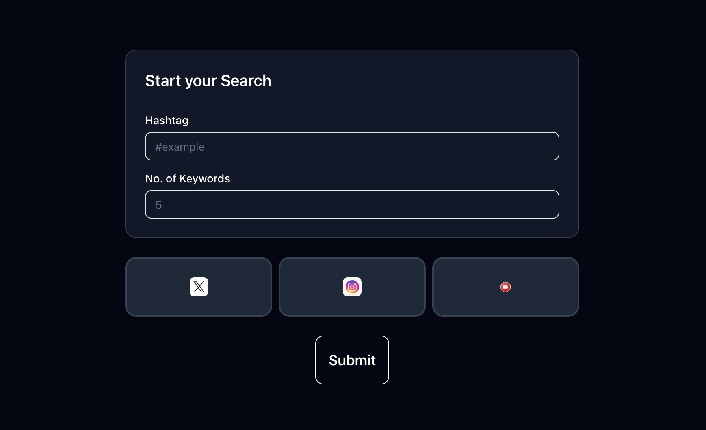

# 🔍 EmSocial

**EmSocial** is an AI-powered web app that lets you **search posts across Instagram, YouTube, and Twitter** by keyword. You can specify how many posts to fetch, and the app performs **sentiment and engagement analysis** using **Google's Gemini API**. Perfect for **social media marketing**, **trend analysis**, and **brand monitoring**.

# 📷 ScreenShots




## ⚙️ Tech Stack

* **Built With**: Next.js
* **Database**: MongoDB
* **AI**: Gemini API (Google)

## 🚀 Features

* Search social posts by keyword
* Sentiment analysis (positive/negative/neutral)
* Engagement insights (likes, comments, shares)
* Platform comparison
* Useful for marketers, analysts, and brands

## 🛠️ Setup

```bash
git clone https://github.com/Brijesh-09/emsocial.git
cd emsocial
npm install
# Add .env with MONGODB_URI and GEMINI_API_KEY
npm run dev
```


